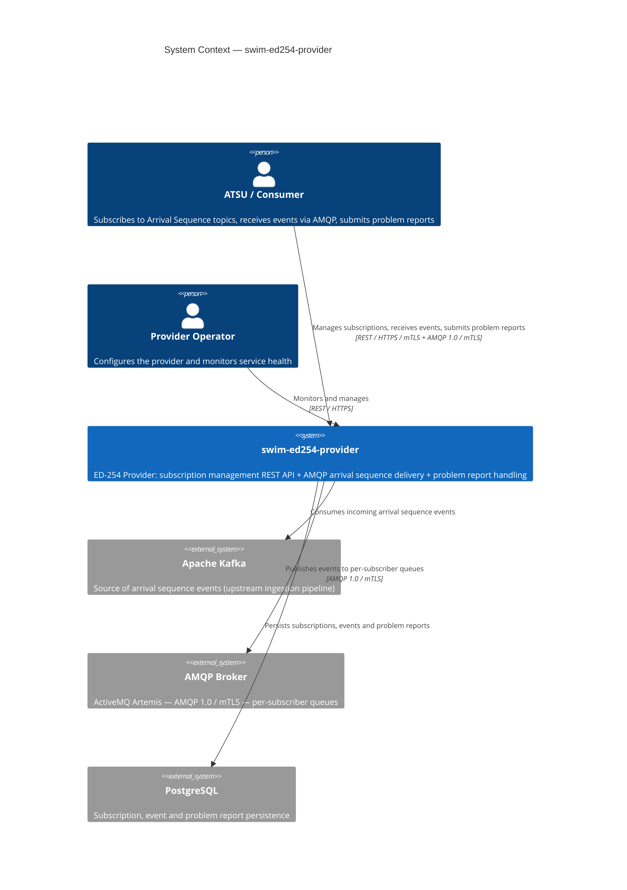
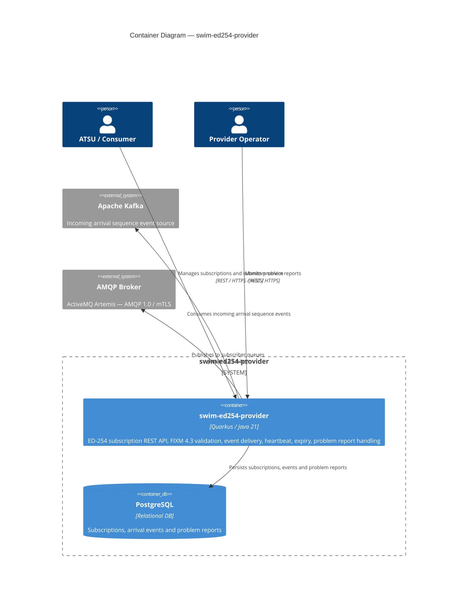
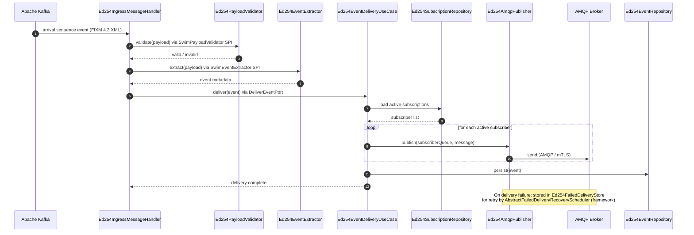
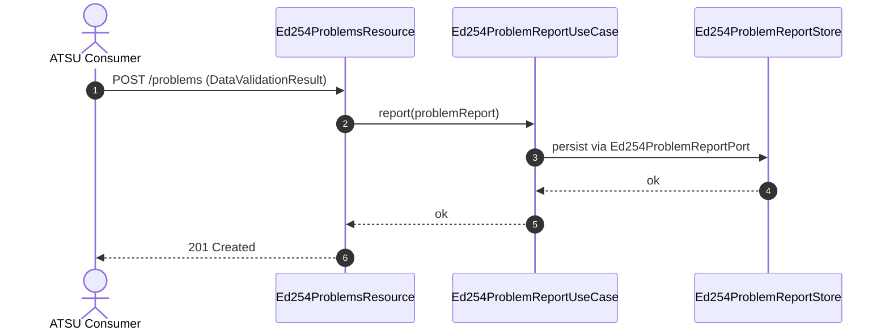

# swim-ed254-provider — Architecture

> Diagrams use [Mermaid](https://mermaid.js.org) and render natively on GitHub.

**Role**: ED-254 Arrival Sequence Provider — exposes a subscription REST API per EUROCAE ED-254, receives arrival sequence events from Kafka, validates FIXM 4.3 payloads, and delivers them to subscriber AMQP queues. Also accepts `DataValidationResult` problem reports from downstream ATSUs (ED-254 REQ-0160).

---

## 1. System Context (C4 Level 1)

---

## 2. Container Diagram (C4 Level 2)

---

## 3. Component Diagram (C4 Level 3)

```mermaid
C4Component
    title Component Diagram — swim-ed254-provider

    System_Ext(kafka, "Apache Kafka")
    System_Ext(broker, "AMQP Broker")
    System_Ext(postgres, "PostgreSQL")

    Container_Boundary(provider, "swim-ed254-provider") {
        Component(subRes, "Ed254SubscriptionResource", "JAX-RS", "REST — subscription creation, update and deletion")
        Component(problemsRes, "Ed254ProblemsResource", "JAX-RS", "REST — receives DataValidationResult problem reports from subscribers (ED-254 REQ-0160)")
        Component(featureRes, "FeatureResource", "JAX-RS", "WFS GetFeature endpoint — queries persisted arrival events")
        Component(topicRes, "Ed254TopicResource", "JAX-RS", "REST — topic listing")

        Component(ingressHandler, "Ed254IngressMessageHandler", "SmallRye Messaging", "Kafka consumer — receives arrival sequence events, validates, delegates to delivery use case")

        Component(subUC, "Ed254SubscriptionUseCase", "CDI", "Subscriber registration, queue provisioning, update, deletion")
        Component(deliveryUC, "Ed254EventDeliveryUseCase", "CDI", "Fan-out: delivers arrival sequence event to all active subscriber AMQP queues")
        Component(queryUC, "Ed254EventQueryUseCase", "CDI", "WFS query over persisted arrival events")
        Component(problemUC, "Ed254ProblemReportUseCase", "CDI", "Processes and persists DataValidationResult problem reports from subscribers")

        Component(payloadValidator, "Ed254PayloadValidator", "JAXB / XSD / SwimPayloadValidator SPI", "Validates FIXM 4.3 payload against ED-254 XSD schema")
        Component(extractor, "Ed254EventExtractor", "CDI / SwimEventExtractor SPI", "Extracts event metadata from FIXM ED-254 message")
        Component(jaxbPool, "Ed254JaxbUnmarshallerPool", "JAXB", "Thread-safe pool of JAXB unmarshallers for FIXM 4.3 XML")

        Component(amqpPublisher, "Ed254AmqpPublisher", "Qpid JMS / SwimAmqpPublisherPort SPI", "Sends AMQP messages to individual subscriber queues")
        Component(heartbeat, "Ed254SubscriptionHeartbeatPublisher", "Quartz", "Publishes heartbeat messages to subscriber queues")
        Component(expiry, "Ed254ExpiryStrategy", "Quartz / SubscriptionExpiryStrategy SPI", "Marks subscriptions as expired when TTL is exceeded")

        Component(evtRepo, "Ed254EventRepository", "JPA / Ed254EventStore port/out", "Arrival event persistence")
        Component(subRepo, "Ed254SubscriptionRepository", "JPA / Ed254SubscriptionStore port/out", "Subscriber persistence")
        Component(failedStore, "Ed254FailedDeliveryStore", "JPA / SwimFailedDeliveryStorePort SPI", "Failed delivery persistence for retry")
        Component(problemStore, "Ed254ProblemReportStore", "JPA / Ed254ProblemReportPort port/out", "Problem report persistence")
    }

    Rel(subRes, subUC, "calls via", "ManageSubscriptionPort")
    Rel(problemsRes, problemUC, "calls via", "Ed254ProblemReportPort")
    Rel(featureRes, queryUC, "calls via", "QueryEventPort")
    Rel(ingressHandler, payloadValidator, "validates with")
    Rel(ingressHandler, extractor, "extracts metadata with")
    Rel(ingressHandler, deliveryUC, "delegates to via", "DeliverEventPort — after validation")
    Rel(deliveryUC, amqpPublisher, "publishes via", "SwimAmqpPublisherPort")
    Rel(deliveryUC, subRepo, "reads active subscribers via", "Ed254SubscriptionStore port")
    Rel(deliveryUC, evtRepo, "persists events via", "Ed254EventStore port")
    Rel(deliveryUC, failedStore, "stores failures via", "SwimFailedDeliveryStorePort")
    Rel(heartbeat, amqpPublisher, "sends heartbeats via", "SwimAmqpPublisherPort")
    Rel(expiry, subUC, "expires subscriptions")
    Rel(problemUC, problemStore, "persists via", "Ed254ProblemReportPort")

    Rel(ingressHandler, kafka, "consumes from")
    Rel(amqpPublisher, broker, "publishes to", "AMQP 1.0 / mTLS")
    Rel(evtRepo, postgres, "persists to")
    Rel(subRepo, postgres, "persists to")
    Rel(failedStore, postgres, "persists to")
    Rel(problemStore, postgres, "persists to")
```

---

## 4. Event Delivery — Sequence

---

## 5. Problem Report Handling (ED-254 REQ-0160)

Downstream ATSUs (consumers) can submit `DataValidationResult` problem reports when they detect issues with received arrival sequence data.

