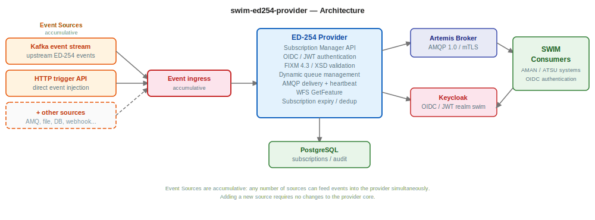

# swim-ed254-provider

AISP-role service for publishing ED-254 (Extended AMAN) Arrival Sequence Service events to subscribers via SWIM infrastructure. Implements the SWIM Subscription Manager API, manages subscriber queues in ActiveMQ Artemis, consumes arrival sequence events from Kafka, and delivers them to subscribed consumers via AMQP 1.0 over TLS.



## What it does

- **Subscription Manager API**, ED-254 compliant REST endpoints with JWT/OIDC authentication (Keycloak) and flight selector filters
- **Dynamic queue management**, creates and removes Artemis queues via Jolokia management API
- **Kafka event consumption**, receives ED-254 arrival sequence events from upstream Kafka topics
- **AMQP event delivery**, publishes ED-254 arrival sequence messages (COOPANS schema) to subscriber queues with outbox pattern and fault tolerance
- **WFS GetFeature**, OGC-compliant endpoint for querying arrival sequence features
- **Problem reporting**, communicates provider exceptions (AMAN unavailable, degraded, sequencing disabled) to subscribers
- **Subscription deduplication**, hash-based detection of identical subscriptions
- **Subscription expiry**, configurable TTL with automatic purge of expired subscriptions
- **Heartbeat publishing**, periodic heartbeats to subscription heartbeat queues
- **Internal API**, separate Vert.x HTTP server (port 9080) for administrative event injection
- **Observability**, OpenTelemetry tracing, Prometheus metrics, structured logging
- **mTLS**, mutual TLS for external consumer connections

---

## GET STARTED

### Prerequisites

- Java 21
- Maven 3.9+
- Podman (or any OCI-compatible runtime with Compose support)
- `mkcert` — [https://github.com/FiloSottile/mkcert](https://github.com/FiloSottile/mkcert) (`brew install mkcert`)
- `keytool` — bundled with JDK 21
- `openssl` — pre-installed on macOS / most Linux distros

### 0. Generate local certificates

Run once from the project root (or after certificate rotation):

```bash
./certs/generate.sh
```

On Windows:

```powershell
powershell -ExecutionPolicy Bypass -File certs/generate.ps1
```

This generates in `certs/`:

| File | Purpose |
|------|---------|
| `ca.crt` | mkcert root CA (PEM) |
| `tls.crt` / `tls.key` | Provider HTTPS server certificate |
| `client.crt` / `client.key` | Provider AMQP client certificate (mTLS to Artemis) |
| `broker.p12` | Artemis broker keystore (PKCS12) |
| `ca-truststore.p12` | Artemis CA truststore (verifies consumer client certs) |
| `keycloak-keystore.p12` | Keycloak HTTPS server keystore |
| `validator-keystore.p12` | Validator AMQP client keystore |
| `validator-truststore.p12` | Validator CA truststore |

### 1. Start the local infrastructure

```bash
podman compose up -d
```

> First run builds the custom Artemis image (`ed254-provider-artemis-local:latest`) — this takes ~2 minutes.
> Subsequent runs use the cached image unless you run `podman compose build`.

> **Tip:** [Quarkus Dev Services](https://quarkus.io/guides/dev-services) can also provision databases and brokers automatically during `./mvnw quarkus:dev`, as an alternative to the `compose.yml`.

Services started:

| Service | Port | Description |
|---------|------|-------------|
| `ed254-provider-artemis` | 5671 (AMQPS/mTLS), 5672 (AMQP), 8161 (console) | AMQP broker (Red Hat AMQ 7.13) |
| `ed254-provider-postgres` | 5432 | Subscription and audit database |
| `kafka` | 9092 | Kafka broker (KRaft) |
| `ed254-provider-akhq` | 9091 | Kafka web UI |
| `keycloak` | 8543 (HTTPS) | OIDC authentication (admin / password) |
| `keycloak-postgres` | 5433 | Keycloak database |
| `ed254-provider-validator` | 8086 | SWIM consumer test harness |
| `ed254-provider-validator-db` | 3309 | Validator database (MariaDB) |

> **Linux only**: add to `/etc/hosts`:
> ```
> 127.0.0.1  host.containers.internal
> 127.0.0.1  keycloak.swim.lab
> ```

### 2. Run the provider

```bash
./mvnw quarkus:dev -Ddebug=false -Dquarkus.http.host=0.0.0.0
```

| URL | Description |
|-----|-------------|
| https://localhost:8443 | REST API (mTLS) |
| https://localhost:8443/swagger-ui | Swagger UI |
| http://localhost:8080 | REST API (plain HTTP, dev mode) |
| http://localhost:9080 | Internal API (event injection) |
| http://localhost:8080/q/health | Health check |
| http://localhost:9091 | AKHQ (Kafka UI) |
| http://localhost:8161 | Artemis console (admin / admin) |
| https://localhost:8543 | Keycloak (admin / password) |
| http://localhost:8086 | Validator UI |

### 3. Verify, happy path

```bash
# Health
curl -s http://localhost:8080/q/health | jq .status

# List topics (does not require authentication)
curl -s http://localhost:8080/arrivalSequenceInformation/v1/topics | jq .

# Get a JWT from Keycloak (required for subscription operations)
TOKEN=$(curl -s -k -X POST \
  https://keycloak.swim.lab:8543/realms/swim/protocol/openid-connect/token \
  -H "Content-Type: application/x-www-form-urlencoded" \
  -d "grant_type=password&client_id=swim-ed254-provider&client_secret=Kp4NwQsF9cHdMzYuR7jLxV3eAb8tGiXo&username=marcelo&password=password" \
  | jq -r .access_token)

# Create a test subscription (filter by destination aerodrome and arrival fix)
curl -s -X POST http://localhost:8080/arrivalSequenceInformation/v1/subscriptions \
  -H "Content-Type: application/json" \
  -H "Authorization: Bearer $TOKEN" \
  -d '{
    "subscriptionFilters": {
      "destinationAerodrome": [
        { "aerodromeDesignator": "LPPT", "assignedArrivalRunway": ["03"] }
      ],
      "pointName": ["RELSO"]
    },
    "supplementaryData": {
      "delay": true,
      "landingSequencePosition": false,
      "amanStrategy": false,
      "departureAerodrome": false,
      "proposedProcedure": false
    },
    "qos": "AT_LEAST_ONCE"
  }' | jq .

# Inject a synthetic ED-254 event via internal API (no auth required — port 9080)
curl -s -X POST http://localhost:9080/internal/v1/trigger \
  -H "Content-Type: application/xml" \
  -d '<arrivalSequence xmlns="http://coopans.org/swim/ed254/arrivalSequence/1.0">
        <creationTime>2026-05-03T10:00:00Z</creationTime>
        <publicationTime>2026-05-03T10:00:01Z</publicationTime>
        <firstMessageAfterServiceOutage>false</firstMessageAfterServiceOutage>
        <aerodromeDesignator>LPPT</aerodromeDesignator>
        <sequenceEntries/>
      </arrivalSequence>' | jq .
```

The provider is working correctly when:
- `GET /q/health/ready` returns `{"status":"UP"}`
- `GET /arrivalSequenceInformation/v1/topics` returns at least one topic
- Subscription creation returns `"subscriptionResult": "SUBSCRIPTION_SUCCESSFUL"` with a `queueName` starting with `ed254-`
- After injecting an event, the subscriber's Artemis queue (visible at http://localhost:8161) receives the message

### 4. Validate infrastructure services

Checks that all compose services are healthy and correctly interconnected:

```bash
./src/local-dev/validate.sh
```

What this script verifies:
- All containers are running (postgres, kafka, akhq, keycloak, artemis)
- `kafka-init` exited cleanly and topics were created
- PostgreSQL is accepting connections
- Keycloak OIDC discovery reachable and token endpoint returns a JWT
- JWT contains `amq-broker` roles (keycloak-swim-role-spi is working)
- Artemis console reachable, ACKMonitorPlugin loaded, AMQP plain send works, AMQPS mTLS handshake succeeds
- Validator UI responding and no datasource errors in logs

What this script does **not** verify: the provider application health, subscription API, or end-to-end event delivery. Use step 3 (curl commands) and the validator UI for that.

---

## About the validator

`ed254-provider-validator` is a test harness that simulates an ANSP subscriber:
- Authenticates with Keycloak and creates a subscription via the provider REST API
- Connects to Artemis via AMQPS (mTLS) and receives delivery of ED-254 messages
- Displays received messages in a web UI at http://localhost:8086
- Validates message format and subscription lifecycle

---

## Keycloak users

All users have password `password`.

| Username | Email | amq-broker roles |
|----------|-------|-----------------|
| `marcelo` | masales@redhat.com | `admin`, `marcelo-swim-ed254-v1-amq-role` |
| `daniel` | daniel@swim.local | `daniel-swim-ed254-v1-amq-role` |
| `ansp1` | ansp1@swim.local | `ansp1-swim-ed254-v1-amq-role` |
| `ansp2` | ansp2@swim.local | `ansp2-swim-ed254-v1-amq-role` |
| `aisp1` | aisp1@swim.local | `aisp1-swim-ed254-v1-amq-role` |

Only `marcelo` has the `admin` amq-broker role and can therefore authenticate to Artemis without a dedicated subscription queue.

---

## API

| Method | Endpoint | Description |
|--------|----------|-------------|
| `POST` | `/arrivalSequenceInformation/v1/subscriptions` | Create subscription (with flight selector filters) |
| `GET` | `/arrivalSequenceInformation/v1/subscriptions` | List subscriptions |
| `GET` | `/arrivalSequenceInformation/v1/subscriptions/{id}` | Get subscription details |
| `PUT` | `/arrivalSequenceInformation/v1/subscriptions/{id}/pause` | Pause subscription |
| `PUT` | `/arrivalSequenceInformation/v1/subscriptions/{id}/resume` | Resume subscription |
| `PUT` | `/arrivalSequenceInformation/v1/subscriptions/{id}/renew` | Renew subscription |
| `DELETE` | `/arrivalSequenceInformation/v1/subscriptions?subscriptionReference={uuid}` | Delete subscription |
| `GET` | `/arrivalSequenceInformation/v1/topics` | List available topics |
| `GET` | `/arrivalSequenceInformation/v1/topics/{topicId}` | Get topic details |
| `POST` | `/arrivalSequenceInformation/v1/problems` | Report provider problem |
| `GET` | `/swim/v1/features` | WFS GetFeature |

Swagger UI available at `/swagger-ui`.

### Internal API (port 9080)

No authentication required. Intended for local development and validator integration only.

| Method | Endpoint | Description |
|--------|----------|-------------|
| `POST` | `/internal/v1/trigger` | Inject an arrival sequence event directly (bypasses Kafka); XML body |
| `POST` | `/internal/v1/validate` | Validate an XML payload against the ED-254 XSD schema; returns `{"valid": true/false, "message": "..."}` |
| `GET` | `/internal/v1/subscriptions/summary` | Count of active/paused subscriptions and subscriber queue list |
| `GET` | `/internal/v1/status` | Provider status, leader election state, and event counters (received/delivered/dead-letter) |

---

## mTLS in dev mode

The provider exposes HTTPS on port 8443 with mutual TLS (`quarkus.http.ssl.client-auth=request`). In dev mode, port 8080 (plain HTTP) remains available as a fallback. The validator always uses port 8443 with the generated certificates.

Artemis exposes AMQPS on port 5671 (`needClientAuth=true`) and plain AMQP on 5672. The provider app itself connects via AMQPS (mTLS), the validator connects via AMQPS with its client certificate.

---

## Environment variables

| Variable | Default | Description |
|----------|---------|-------------|
| `POSTGRES_HOST` | — | PostgreSQL host |
| `POSTGRES_PORT` | `5432` | PostgreSQL port |
| `POSTGRES_DB` | — | Database name |
| `POSTGRES_USER` | — | Database user |
| `POSTGRES_PASSWORD` | — | Database password |
| `AMQP_HOST` | — | Artemis broker host |
| `AMQP_PORT` | `5672` | AMQP port |
| `AMQP_USERNAME` | `admin` | AMQP username |
| `AMQP_PASSWORD` | `admin` | AMQP password |
| `KAFKA_BOOTSTRAP_SERVERS` | `kafka-kafka-bootstrap:9092` | Kafka bootstrap servers |
| `KAFKA_TOPIC` | `ed254-events-all-topic` | Kafka topic to consume events from |
| `KAFKA_GROUP_ID` | `swim-ed254-provider` | Kafka consumer group ID |
| `OIDC_ENABLED` | `true` | Enable OIDC authentication on the REST API |
| `OIDC_CLIENT_ID` | `swim-ed254-provider` | OIDC client ID |
| `SWIM_TOPICS` | `ArrivalSequenceService` | Comma-separated list of published topics |
| `KUBERNETES_NAMESPACE` | `swim-demo` | Namespace for reading Artemis config Secrets |
| `INTERNAL_SERVER_PORT` | `9080` | Port for the internal event injection API |
| `OTEL_ENABLED` | `true` | Enable OpenTelemetry tracing |
| `OTEL_ENDPOINT` | `http://localhost:4317` | OTLP collector endpoint |
| `PROMETHEUS_ENABLED` | `true` | Enable Prometheus metrics at `/q/metrics` |
| `QUARKUS_HTTP_SSL_CERTIFICATE_FILES` | `/certs/server/tls.crt` | Server certificate (HTTPS) |
| `QUARKUS_HTTP_SSL_CERTIFICATE_KEY_FILES` | `/certs/server/tls.key` | Server private key (HTTPS) |
| `QUARKUS_HTTP_SSL_CERTIFICATE_TRUST_STORE_FILE` | `/certs/ca/ca.crt` | CA for client certificate validation (mTLS) |

---

## Container images

Pre-built multi-arch images (linux/amd64 + linux/arm64):

```
quay.io/masales/swim-ed254-provider:latest
```

---

## Build

### From source

```bash
./mvnw clean package -DskipTests
```

### Container images

```bash
make jvm                 # JVM multi-arch image, build + push  (fastest)

make native-amd64        # Native amd64, build + push  (run on amd64 machine)
make native-arm64        # Native arm64, build + push  (run on arm64 machine)
make manifest            # Create multi-arch manifest from registry images
make push                # Push manifest to registry
```

Override registry or tag: `make jvm REGISTRY=quay.io/myorg TAG=v1.2.3`

Run `make deps` to see which sibling repos to install first.

---

## Health checks

| Endpoint | Description |
|----------|-------------|
| `/q/health/live` | Liveness probe |
| `/q/health/ready` | Readiness probe |
| `/q/health` | Combined status |

---

## Deployment

Helm chart in `src/main/helm/` with CRC and production values.

For operator-based deployment (single CR), see [swim-operator](https://github.com/swim-developer/swim-operator).

---

## Related projects

| Project | Why you need it |
|---------|----------------|
| [swim-ed254-provider-validator](https://github.com/swim-developer/swim-developer-validators) | Client-side validator that tests this provider end-to-end |
| [swim-developer-extensions](https://github.com/swim-developer/swim-developer-extensions) | Kafka inbox routers that feed ED-254 events into this provider |
| [swim-fixm-model-ed254](https://github.com/swim-developer/swim-fixm-model-ed254) | FIXM 4.3 + ED-254 JAXB bindings used internally |
| [swim-developer-framework](https://github.com/swim-developer/swim-developer-framework) | Core framework this service is built on |
| [swim-developer-tools](https://github.com/swim-developer/swim-developer-tools) | Certificate generation, full-stack compose, pipelines |

---

## License

Licensed under the [Apache License 2.0](LICENSE).

## Changelog

- 2026-05-03: Align local dev environment with swim-dnotam-provider (mTLS, AKHQ, RHBK Keycloak, validator, self-contained certs)
